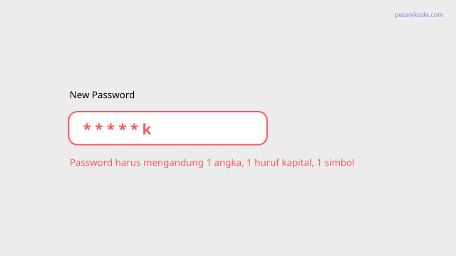
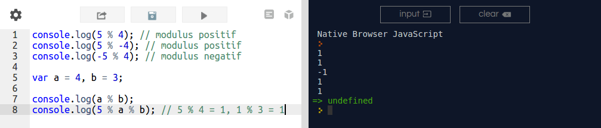
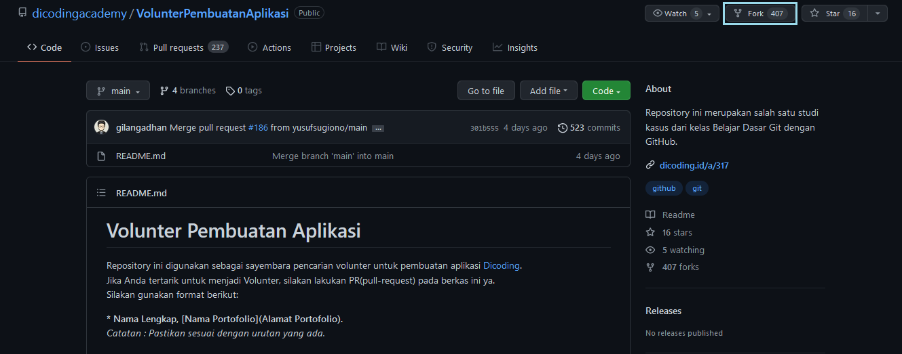
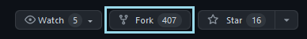
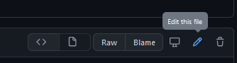
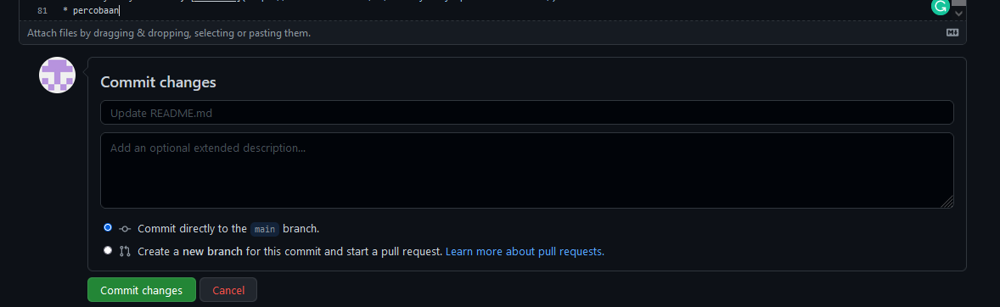
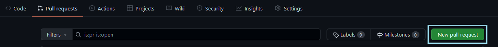
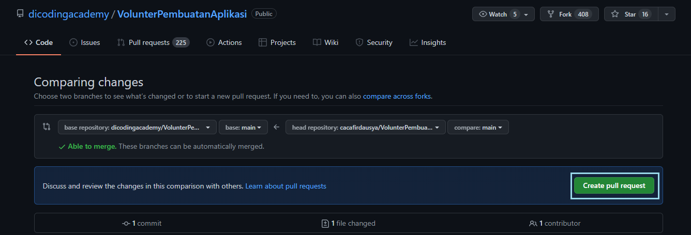

- **Rekursif**

Fungsi rekursif dalam pemrograman merupakan fungsi yang memanggil dirinya sendiri. Fungsi rekursif sering saya bayangkan seperti perulangan. Karena tingkah lakunya yang mengulang-ulang setiap pemanggilan dirinya.

Berikut ini contoh sederhana fungsi rekursif.

    function fungsiRekursif(){
    console.log("Hello, ini fungsi rekursif");
    fungsiRekursif();
    }

Dua contoh fungsi di atas akan menampilkan teks "Hello, ini fungsi rekursif" terus menerus, karena memanggil dirinya sendiri tampa henti.

Fungsi rekursif dapat menyelesaikan beberapa persoalan seperti perhitungan bilangan fibbonaci dan faktorial.

Berikut ini animasi fungsi rekursif dalam menghitung faktorial dari 5.

    faktorial(5) = 5 * faktorial(4)
    faktorial(4) = 4 * faktorial(3)
    faktorial(3) = 3 * faktorial(2)
    faktorial(2) = 2 * faktorial(1)
    faktorial(1) = 1

Maka faktorial(5) = 5 * 4 * 3 * 2 * 1, akan menghasilkan 120.

- **Regex**

Apakah kamu pernah membuat password, dan di sana kita diminta harus menggunakan huruf kapital, angka, dan simbol.

Jika kita tidak mematuhinya, maka akan diberikan peringatan:

Bagaimana program bisa tau, kalau kita tidak mematuhinya?

Bagaimana program mampu mengenali password yang kita inputkan?

Ini semua berkat regex.

Di balik program yang terlihat cukup cerdas itu, ada peran regex di sana.

Jadi:

-**Apa itu Regex**??

Regex adalah singkatan dari Regular Expresion. Regex merupakan sebuah teks (string) yang mendefinisikan sebuah pola pencarian sehingga dapat membantu kita untuk melakukan matching (pencocokan), locate (pencarian), dan manipulasi teks.

Konsep tentang regex pertamakali muncul di tahun 1951, ketika seorang ilmuan matematikan bernama Stephen Cole Kleene memformulasikan definisi tentang bahasa formal. Kemudian konsep ini diadopsi di beberapa program dan menjadi umum digunakan pada program pemeroses teks seperti sed, awk, grep, dll. Regex memudahkan kita untuk memanipulasi teks, tapi juga kadang berbahaya.. karena bisa mengubah teks yang tidak kita inginkan.

Biasanya itu terjadi karena kesalahan pola yang diberikan.

- **Manfaat Regex dalam Pemrograman**
Berdasarkan definisi regex yang sudah kita pelajari, kita bisa tahu tiga manfaat penting regex yakni pencarian, pencocokan, dan manipulasi teks.

Berikut ini beberapa contoh pemanfaatan regex dalam pemrograman:

1. Regex untuk Validasi Data
Seperti contoh kasus password tadi, regex digunakan untuk matching atau pencocokan teks.

Pertama-tama, kita harus mendefinisikan pola regex untuk data yang valid. Kemudian, kita lakukan pencocokan dengan pola tersebut.

Berikut ini contohnya di HTML dan Javascript.

Kode HTML:

    <form id="myform">
    <label for="passowrd">Buat Password</label>
    <input type="password" name="password" pattern="(?=.*\d)(?=.*[a-z])(?=.*[A-Z]).{8,}" />
    <input type="submit" value="simpan" />
    

    Panjang password minimal 8 kareter, dan harus mengandung huruf kapital, angka, dan simbol

    </form>

Perhatikan atribut pattern, atribut ini digunakan untuk menyimpan pola regex. Pada contoh di atas, polanya adalah pengecekan karakter yang diinputkan pada password.

Berikut ini kode Javascript untuk memberikan feedback:

    const passwordField = document.querySelector("[name=password]");

    passwordField.addEventListener("keyup", (event) => {
    if(!passwordField.validity.valid){
        console.error("passowrd invalid");
        document.getElementById("invalid-passowrd").style.display = "block";
    } else {
         console.info("passowrd valid");
        document.getElementById("invalid-passowrd").style.display = "none";
    }
    });

    
  Pada contoh ini, kita tidak menggunakan regex di dalam Javascript. Melainkan kita menggunakannya pada HTML.

Kode javascript di atas, hanya bertugas untuk mengecek.. apakah nilai dari field password sudah sesuai atau tidak dengan yang ada pada atribut pattern.
Berikut ini hasilnya:

2. Regex untuk Pencarian
Contoh penerapan regex untuk pencarian sebenarnya hampir sama dengan validasi data.

Pola regex dimasukan dalam kata kunci, lalu dicocokan dengan database atau teks.

Contoh program yang menerapkan ini adalah grep. Program grep (globally search for a regular expression and print matching lines) biasanya kita temukan di sistem operasi Unix dan Linux, bahkan ini menjadi program yang selalu ada di setiap distro Linux. Program grep melakukan pencarian berdasarkan pola regex yang diberikan, lalu mencetak output hasilnya.

Contoh:

Misalkan kita ingin mencari teks pada syslog. Kita bisa melihat isi file syslog dengan cat.

    cat /var/log/syslog

Perintah ini akan menampilkan banyak sekali teks. Nah di sini kita bisa memanfaatkan grep untuk mencari teks tertentu pada log.

Misalnya:

Saya ingin tau apa saja log yang berkaitan dengan jaringan:
    cat /var/log/syslog | grep network

Perhatikan, kata network ini adalah pola regex yang akan menjadi kata kunci pencarian.
Grep akan mewarnai hasil teks yang cocok dengan pola regex yang diberikan.

Dari hasil tersebut, saya bisa tahu apa saja log yang sudah dilakukan pada jaringan di komputer saya.

Tidak hanya di grep, pada beberapa teks editor juga menerapkan regex untuk pencarian. Pada VS Code, ada mode pencarian dengan regex. Di sana kita bisa memasukan pola regex. Misal saya ingin mencari di mana saja penulisan nama file js dalam kode 

Ini sangat memudahkan..

Saya sering pakai ini terutama saat melakukan Find and Replace. 

3. Regex untuk Find and Replace
Salah satu manfaat regex yang saya suka adalah find and replace. Fitur ini membantu saya untuk mengelola teks dan konten lebih efisien.

Bayangkan saja..

Di petani kode ada ratusan konten dengan format markdown. Lalu di suatu kondisi saya ingin mengubah beberapa teks di semua konten ini.

Jika dilakukan satu-per-satu secara manual, tentu ini akan menguras banyak waktu dan tenaga.

Tapi, Berkat regex, saya bisa melakukannya dalam hitungan detik. Cukup bikin pola pencarian dan pola untuk mengubahnya (subtitusi).

Contoh:

Saya ingin mengubah ini:

    
    

Menjadi ini:

    ")
    

Maka pola pencariannya adalah:

    (\{\{< fig) "(.+)"( | \n)"(.+)" (>\}\})

dan pola untuk merubahnya:
    
    

maka hasilnya:

- **Pengertian OOP**

OOP (Object Oriented Programming) adalah suatu metode pemrograman yang berorientasi kepada objek. Tujuan dari OOP diciptakan adalah untuk mempermudah pengembangan program dengan cara mengikuti model yang telah ada di kehidupan sehari-hari. Jadi setiap bagian dari suatu permasalahan adalah objek, nah objek itu sendiri merupakan gabungan dari beberapa objek yang lebih kecil lagi. Saya ambil contoh Pesawat, Pesawat adalah sebuah objek. Pesawat itu sendiri terbentuk dari beberapa objek yang lebih kecil lagi seperti mesin, roda, baling-baling, kursi, dll. Pesawat sebagai objek yang terbentuk dari objek-objek yang lebih kecil saling berhubungan, berinteraksi, berkomunikasi dan saling mengirim pesan kepada objek-objek yang lainnya.

- **APA ITU OOP?**

OOP (Object Oriented Programming) atau dalam bahasa indonesia dikenal dengan pemrograman berorientasikan objek (PBO) merupakan sebuah paradigma atau teknik pemrograman yang berorientesikan Objek.
Pada OOP, Fungsi dan variabel dibungkus dalam sebuah objek atau class yang dapat saling brinteraksi, sehingga membentuk sebuah program.

Variabel dalam objek akan menyimpan data dari objek. Sedangkan fungsi akan menentukan operasinya.

Contoh objek dalam dunia nyata: Mobil, Burung, Drone, Meja, Pohon, dll.

    ------------------OBJEK
    Drone
    ------------------Variabel/Atribut
    energi = 100;
    ketinggian = 200;
    kecepatan = 29;
    ------------------Fungsi
    terbang();
    matikanMesin();
    turun();
    maju();
    mundur();
    belok();
    ------------------

- **CLASS DAN OBJECT**

Class adalah rancangan atau blue print dari sebuah objek.

Sedangkan objek dalam pemrograman adalah sebuah variabel yang merupakan instance dari Class.

Instance bisa diartikan sebagai wujud dari class.

Class berisi definisi variabel dan fungsi yang menggambarkan sebuah objek.

Dalam OOP:

Variabel disebut atribut atau properti;
Fungsi disebut method.
Contoh Class:

    class NamaClass {
    String atribut1;
    String atribut2;

    void namaMethod(){ ... }
    void namaMethodLain(){ ... }    
    }

**Empat Pilar OOP**

- Abstrak Class

Kelas merupakan deskripsi abstrak informasi dan tingkah laku dari sekumpulan data.
Kelas dapat diilustrasikan sebagai suatu cetak biru(blueprint) atau prototipe yang digunakan untuk menciptakan objek.
Kelas merupakan tipe data bagi objek yang mengenkapsulasi data dan operasi pada data dalam suatu unit tunggal.
Kelas mendefinisikan suatu struktur yang terdiri atas data kelas (data field), prosedur atau fungsi (method), dan sifat kelas (property).

- Encapsulation

Istilah enkapsulasi sebenarnya adalah kombinasi data dan fungsionalitas dalam sebuah unit tunggal sebagai bentuk untuk menyembunyikan detail informasi.
Proses enkapsulasi memudahkan kita untuk menggunakan sebuah objek dari suatu kelas karena kita tidak perlu mengetahui segala hal secara rinci.
Enkapsulasi menekankan pada antarmuka suatu kelas, atau dengan kata lain bagaimana menggunakan objek kelas tertentu.
Contoh:

 kelas mobil menyediakan antarmuka fungsi untuk menjalankan mobil tersebut, tanpa kita perlu tahu komposisi bahan bakar, udara dan kalor yang diperlukan untuk proses tersebut.

- Inheritance

Kita dapat mendefinisikan suatu kelas baru dengan mewarisi sifat dari kelas lain yang sudah ada.
Penurunan sifat ini bisa dilakukan secara bertingkattingkat, sehingga semakin ke bawah kelas tersebut menjadi semakin spesifik.
Sub kelas memungkinkan kita untuk melakukan spesifikasi detail dan perilaku khusus dari kelas supernya.
Dengan konsep pewarisan, seorang programmer dapat menggunakan kode yang telah ditulisnya pada kelas super berulang kali pada kelas-kelas turunannya tanpa harus menulis ulang semua kodekode itu.

- Polymorphism

Polimorfisme merupakan kemampuan objekobjek yang berbeda kelas namun terkait dalam pewarisan untuk merespon secara berbeda terhadap suatu pesan yang sama.
Polimorfisme juga dapat dikatakan kemampuan sebuah objek untuk memutuskan method mana yang akan diterapkan padanya, tergantung letak objek tersebut pada jenjang pewarisan.
Method overriding.
Method name overloading.

- **KARAKTERISTIK OOP**

- Semua adalah objek.
- Komputasi dilakukan dengan komunikasi antar objek. Setiap objek berkomunikasi dengan objek yang lain melalui pengiriman dan penerimaan pesan.
- Sebuah pesan merupakan permintaan atas sekumpulan aksi dengan semua argumen yang diperlukan untuk menyelesaikan suatu tugas tertentu.
- Setiap objek memiliki memori sendiri, yang dapat terdiri dari objek-objek lainnya.
Setiap objek adalah wakil atau representasi dari suatu kelas. Sebuah kelas dapat mewakili sekelompok objek yang sama.
- Kelas merupakan kumpulan tingkah laku yang berkaitan dengan suatu objek. Jadi, semua objek yang merupakan wakil dari kelas yang sama dapat melakukan aksi yang sama pula.
- Kelas-kelas diorganisasikan ke dalam struktur pohon yang berakar tunggal, yang dinamakan dengan jenjang pewarisan (inheritance hierarchy).
- Setiap objek pada umumnya memiliki tiga sifat, yaitu keadaan, operasi dan identitas objek.
- Operasi merupakan tindakan yang dapat dilakukan oleh sebuah objek.
Keadaan objek merupakan koleksi dari seluruh informasi yang dimiliki oleh objek pada suatu saat.
- Informasi yang terkandung pada objek tersebut pada akhirnya memberikan identitas khusus yang membedakan suatu objek dengan objek lainnya.
Contoh Program

    class Kendaraan{

    int posisi1;
    
    int kecepatan;
    
    int posisi2;
    
    int pergerakan;
    
    int getPosisi1(){

    return posisi1;

    }

    void setPosisi1(int theposisi1){

    posisi1 = theposisi1;

    }

    int getKecepatan(){

    return kecepatan;

    }

    void setKecepatan(int thekecepatan){

    kecepatan = thekecepatan;
    
    }

    posisi2 bergerak(){

    int jarak;
    
    int waktu;

    posisi2 = getKecepatan * waktu;

    }
    }

    class Mobil extends Kendaraan{

    }

    class KendaraanTestDrive{

    Mobil avanza = new Mobil;

    avanza.setPosisi1(30);
    
    avanza.setKecepatan(45);

    avanza.bergerak();

    }

- **Modulus**

Operasi modulus menggunakan karakter percent, %. Operasi modulus merupakan operasi untuk menghasilkan sisa, remainder, dari hasil pembagian. Oleh karena itu hasil dari operasi modulus selalu merupakan bilangan bulat, baik negatif, nol, atau positif.

- **Assyncronous**

hasil eksekusi atau output tidak selalu berdasarkan urutan kode, tetapi berdasarkan waktu proses. Eksekusi dengan asynchronous tidak akan membloking atau menunggu suatu perintah sampai selesai. Daripada menunggu, asynchronous akan mengeksekusi perintah selanjutnya. 

    console.log('Hello');

    setTimeout(() => { console.log('Javascript')},100) // tunda selama 100 miliseconds

    console.log('Coder');

    /* ----------

    Output :
    Hello!
    Coder
    Javascipt
    ------------*/

- Catatan :

Pada baris ke 2 setTimeout digunakan untuk menunda eksekusi dalam satuan milisecond dalam hal ini untuk simulasi prosess async.

Perhatikan bahwa outputnya tidak berurutan sesuai input (kode). Karena cara kerja asynchronous adalah berdasarkan waktu proses. Jika ada salah satu eksekusi membutuhkan proses yang agak lama, maka sembari menunggu prosess tersebut javascript mengeksekusi perintah selanjutnya.

Mari kita lihat performancenya, Sebagai contoh ada 3 perintah dengan waktu proses masing-masing.

Tapi ada yang menjadi pertimbangan yang disebut race condition. Race Condition terjadi ketika ada satu perintah yang bergantung pada output eksekusi asynchronous sebelumnya.Dengan kata lain kejar-kejaran. Contoh :

    console.log('hello')
    
    let user = requestAjax() // di eksekusi secara asynchronous
    displayUser(user)

Dari contoh kode diatas besar kemungkinan displayUser menampilkan data kosong, karena belum tentu output dari ekskusi requestAjax sudah selesai.

Solusi untuk problem ini yaitu menggunakan teknik callback, promise, generator atau asyc/await yang akan kita kupas lebih dalam di sesi berikutnya.

Sampai disini mungkin timbul beberapa pertanyaan.

- Apakah javascript secara default mengeksekusi perintah dengan metode synchronous atau asynchronous ?
- Bisakah kita membuat proses asynchronous ?
- Dalam kasus apa teknik asynchronous digunakan ?

**Jawabannya** :

- Javascript secara default mengeksekusi perintah secara synchronous, kecuali untuk beberapa hal seperti : ajax,websocket, worker, file, database, animasi dan beberapa hal lainya.
- Kita tidak bisa membuat proses asynchronous murni. Tapi untuk membuat simulasi iya kita bisa menggunakan fungsi setInternal dan setTimeout
- Teknik Asynchronous paling banyak digunakan mengelola komunikasi yang tidak mungkin sinkron atau harus menunggu seperti proses request ajax, operasi file, koneksi ke database, websocket, real time communication seperti pada aplikasi chating dan masih banyak lagi.

-**Array**

1. Apa itu Array?
Sebelum kita membahas Array, kita bahas dulu apa itu struktur data?

Struktur data merupakan cara-cara atau metode yang digunakan untuk menyimpan data di dalam memori komputer.

Salah satu struktur data yang sering digunakan dalam pemrograman adalah Array.

Array merupakan struktur data yang digunakan untuk menyimpan sekumpulan data dalam satu tempat.

Setiap data dalam Array memiliki indeks, sehingga kita akan mudah memprosesnya.

Indeks array selalu dimulai dari angka nol (0).

Pada teori struktur data Ukuran array akan bergantung dari banyaknya data yang ditampung di dalamnya. 

- Cara Membuat Array pada Javascript
Pada javascript, array dapat kita buat dengan tanda kurung siku ([...]).

Contoh:

    var products = [];

Maka variabel products akan berisi sebuah array kosong. Kita bisa mengisi data ke dalam array, lalu setiap data dipisah dengan tanda koma (,).

Contoh:

    var products = ["Flashdisk", "SDD", "Monitor"];

karena javascript merupakan bahasa pemrograman yang dynamic typing, maka kita bisa menyimpan dan mencampur apapun di dalam array.

Contoh:
    
    var myData = [12, 2.1, true, 'C', "Febby"];

-   Cara Mengambil Data dari Array
Seperti yang sudah kita kethaui…

Array akan menyimpan sekumpulan data dan memberinya nomer indeks agar mudah diakses.

Indeks array selalu dimauli dari nol 0.

Misalkan kita punya array seperti ini:

    var makanan = ["Nasi Goreng", "Mie Ayam", "Mie Gelas"];

- Bagaimana cara kita mengambil nilai "Mie Ayam"?

Jawabannya seperti ini:

    makanan[1] //-> "Mie Ayam"

- Kenapa bukan 2?

Ingat: indeks array selalu dimulai dari nol.

Biar lebih jelas, mari kita coba dalam program:

    <!DOCTYPE html>
    <html lang="en">
    <head>
    <title>Mengambil data dari array</title>
    </head>
    <body>
    
    </body>
    </html>

Hasilnya:

- Mencetak isi Array dengan Perulangan

Kita bisa saja mencetak semua isi array satu-per-satu seperti ini:

    document.write(products[0]);
    document.write(products[1]);
    document.write(products[2]);
    document.write(products[3]);
    document.write(products[4]);

Bagaimana kalau nanti isi array-nya ada 100?

Tentu kita tidak akan mau menulis 100 baris kode untuk mencetak array. 

Mari kita lihat contohnya:

    <!DOCTYPE html>
    <html lang="en">
    <head>
    <title>Array dan perulangan</title>
    </head>
    <body>
       
    </body>
    </html>

Hasilnya:

Perhatikan…

Pada contoh di atas, kita menggunakan properti length untuk mengambil panjang array.

Kita memiliki 4 data di dalam array products, maka properti length akan bernilai 4.

Lalu kita gunakan properti ini untuk membatasi jumlah perulangan di dalam for.

    for(let i = 0; i < products.length; i++){
    document.write(`<li>${ products[i] }</li>`);
    }

dan di dalam blok for, kita mencetak isi produk dengan indeks yang mengacu pada variabel i.

Cara lain:

Kita bisa mengunakan perulangan dengan method forEach().

Contoh:

    <!DOCTYPE html>
    <html lang="en">
    <head>
    <title>Array dan perulangan</title>
    </head>
    <body>
    
    </body>
    </html>

Hasilnya akan sama seperti di atas.

- Cara Menambahkan Data ke Dalam Array

Ada dua cara yang bisa dilakukan untuk menambah data ke dalam array:

Mengisi menggunakan indeks;
Mengisi menggunakan method push().
Mengisi dengan indeks maksudnya begini…

Misal kita punya array dengan isi sebagai berikut:

    var buah = ["Apel", "Jeruk", "Manggis"];

Terdapat tiga data di dalam array buah dengan indeks:

    0: "Apel"
    1: "Jeruk"
    2: "Manggis"

Kita ingin menambahkan data lagi pada indeks ke-3, maka kita bisa melakukannya seperti ini:
    
    buah[3] = "Semangka";

Sekarng array buah akan berisi 4 data.

Mari kita coba pada console Javascript.

"Semangka" berhasil kita tambahkan ke dalam array buah.

Tapi kekurangan dari cara ini ialah:

Kita harus tahu jumlah data atau panjang array-nya, barulah kita bisa menambahkan.

Apabila kita memasukan nomer indeks sembarangan, maka nanti yang akan terjadi adalah data yang ada di daalam indeks tersebut akan ditindih.

Lalu solusinya bagaimana donk?

Kita gunakan method push().

Kita tidak perlu tahu berapa panjang array-nya, karena method push() akan menambahkan data ke dalam array dari ekor atau belakang.

Contoh:

    <!DOCTYPE html>
    <html lang="en">
    <head>
    <title>Mengisi data ke array</title>
    </head>
    <body>
    
    </body>
    </html>

Maka hasilnya:

Kita juga bisa menambahkan beberapa data sekaligus dengan cara seperti ini:

    products.push("Alarm", "Gemobok", "Paku");

- Cara Menghapus Data Array

Sama seperti menambahkan data ke array, menghapus data juga memiliki dua cara:

    Menggunakan delete;
    Menggunakan method pop().

Contoh:

    delete buah[2];

Kita dapat menghapus data dengan nomer indeks tertentu dengan delete. Sedangkan pop() akan menghapus dari belakang.

Kekurangan dari delete, ia akan menciptakan ruang kosong di dalam array.

Percobaan di dalam console:

Tentu ini kurang bagus…

karena array akan tetap memiliki panjang 4.

Cara kedua menggunakan method pop(), kebalikan dari method push().

Method pop() akan menghapus array yang ada di paling belakang.

Array pada javascript dapat kita pandang sebagai sebuah stack (tumpukan), yang mana memiliki sifat LILO (Last in Last out).

Mari kita coba di dalam console.

Kita memanggil method pop() sebanyak 4 kali, maka array-nya akan kosong []. Karena isinya hanya 4 saja.

Method pop() akan mengembalikan nilai item atau data yang terhapus dari array.

Menghapus Data dari Depan
Kita juga dapat menghapus data dari depan dengan menggunakan method shift().

Contoh:

    var bunga = ["Mawar", "Melati", "Anggrek", "Sakura"];

    // hapus data dari depan
    bunga.shift();

Maka data yang terhapus adalah "Mawar".

Percobaan pada conosole:
Menghapus Data pada Indeks Tertentu
Apabila kita ingin menghapus data pada inteks tertentu, maka fungsi atau method yang digunakan adalah splice().

Fungsi ini memiliki dua parameter yang harus diberikan:

    array.splice(<indeks>, <total>);

Keterangan:

    <indeks> adalah indeks dari data di dalam array yang akan dihapus;
    <total> adalah jumlah data yang akan dihapus dari indeks tersebut.
Biasanya kita berikan nilai total dengan nilai 1 agar hanya menghapus satu data saja.

Contoh:

    var bunga = ["Mawar", "Melati", "Anggrek", "Sakura"];

// hapus Anggrek
bunga.splice(2, 1);
Percobaan pada console:

Keterangan:

    <indeks> adalah indeks dari data di dalam array yang akan dihapus;
    <total> adalah jumlah data yang akan dihapus dari indeks tersebut.
Biasanya kita berikan nilai total dengan nilai 1 agar hanya menghapus satu data saja.

Contoh:

    var bunga = ["Mawar", "Melati", "Anggrek", "Sakura"];

    // hapus Anggrek
    bunga.splice(2, 1);

Percobaan pada console:

    Pada percobaan di atas, apabila kita tidak mengisi <total> data yang akan dihapus, maka semua data dari indeks yang terpilih akan dihapus.

Mengubah isi Array
Untuk mengubah isi array, kita bisa mengisi ulang seperti ini:

    var bahasa = ["Javascript", "Kotlin", "Java", "PHP", "Python"];
    bahasa[1] = "C++";
    Maka "Kotlin" akan diganti dengan "C++".

Percobaan pada console:

- Method-method penting pada Array
Selain method-method atau fungsi yang sudah kita coba di atas, terdapat beberapa method dalam Array yang perlu kita ketahui.

1. Method filter()
Method filter() berfungsi untuk menyaring data dari array.

Parameter yang harus diberikan pada method filter() sama seperti method forEach(), yaitu: sebuah fungsi callback.

Contoh:

        const angka = [1, 2, 3, 4, 5, 6, 7, 8, 9];

    // Kita ambil data yang hanya habis dibagi dua saja
    const filteredArray = angka.filter((item) => {return item % 2 === 0});

    console.log(filteredArray) // -> [2, 4, 6, 8]
Pada contoh di atas, kita memberikan arrow function sebagai fungsi callback yang akan melakukan penyaringan terhadap array.

Sebenarnya kita bisa buat lebih sederhana lagi seperti ini:

    const filteredArray = angka.filter(item => item % 2 === 0);
2. Method includes()
Method ini berfungsi untuk mengecek apakah sebuah data ada di dalam array atau tidak. Biasanya digunakan untuk melakukan pencarian untuk memastikan data sudah ada di dalam array.

Contoh:

    var tanaman = ["Padi", "Kacang", "Jagung", "Kedelai"];

    // apakah kacang sudah ada di dalam array   tanaman?
    var adaKacang = tanaman.includes("Kacang");

    console.log(adaKacang); // -> true

    // apakah bayam ada?
    var adaBayam = tanaman.includes("Bayam");

    console.log(adaBayam); // -> false
3. Method sort()
Method sort() berfungsi untuk mengurutkan data pada array.

Contoh:

    var alfabet = ['a','f','z','e','r','g'];
    var angka = [3,1,2,6,8,5];

    console.log(alfabet.sort()); //->  ["a", "e", "f", "g", "r", "z"]
    console.log(angka.sort()); // -> [1, 2, 3, 4, 5, 6, 7, 8, 9]

- **Github Lanjutan**

Dalam melakukan kolaborasi ini kita akan menggunakan fitur pull request untuk mengimplementasikan perubahan yang dilakukan ke dalam repositori asli. Apa itu pull request? Pull request ini merupakan permintaan untuk menggabungkan (merge) kode yang telah dimodifikasi dengan repositori utama atau repositori lain. Proses pull request biasanya memungkinkan kita untuk mengelola hak akses bagi pengguna yang dapat menggabungkan kode (merge) dan menentukan pengguna yang dapat memberikan komentar. Dengan mengatur hak akses terhadap suatu branch dapat membantu untuk memaksimalkan fitur pull request. Pull request sangat umum saat ini, karena digunakan oleh hampir setiap perusahaan dengan tim pengembang minimal 3 orang atau lebih. Terlebih pada berbagai proyek open-source yang sudah mainstream menggunakan metode pull request untuk manajemen kolaborasi sesama kontributor. Lalu bagaimana cara melakukan pull request? Nah, berikut ini adalah langkah-langkah dalam melakukan kolaborasi pada public repository:

- Menyalin repositori.
Jika ingin berkolaborasi pada public repository kita harus menjalankan git fork atau menyalin repositori. Pertama buka terlebih dahulu repositori yang akan disalin.

- Melakukan forking.
Klik “Fork” untuk menyalin repository tersebut ke repository pribadi.

Setelah itu, akan ada repositori baru dari hasil forking dari sebuah repositori. Repositori tersebut sudah menjadi milik kita dan dapat melakukan perubahan apapun.

Tulisan sesudah kata forked from menandakan repositori asal.

- Melakukan perubahan pada repositori.

Selanjutnya melakukan pull request melalui repositori yang sudah di forking, lalu pilih salah satu file yang ingin diubah contohnya disini saya memilih README.md. Lakukan perubahan dengan meng-klik ikon pensil terlebih dahulu.

Kemudian lakukan perubahan pada file yang sudah dipilih yang ada dalam repositori pada branch main. Jika sudah yakin dengan perubahan, klik tombol “Commit changes” yang berwarna hijau untuk menyimpan perubahan tersebut.

- Melakukan pull request ke repositori asal.
Selanjutnya ialah meminta izin ke pemilik akun repositori tersebut dengan meng-klik tab ‘Pull Request’ lalu klik tombol ‘New pull request’ yang bewarna hijau untuk membuat permintaan.

Lanjutkan dengan klik tombol ‘Create pull request’

Setelah itu, dari pengelola repositori asal akan melakukan review terlebih dahulu sebelum melakukan penggabungan (merge) kode.
